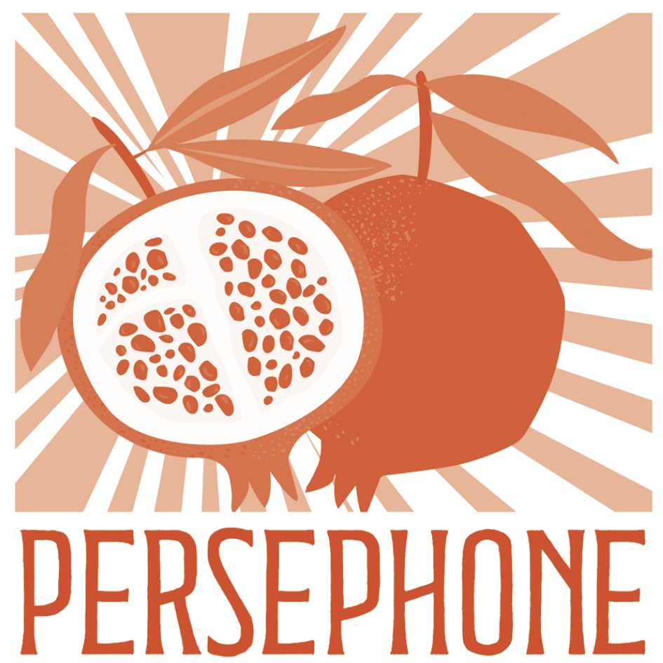

Orientierung

# Wo stehst Du gerade?

Menschen mit unerfülltem Kinderwunsch kommen in unterschiedlichen Momenten zu Persephone. Deshalb fragen wir zuallererst nach Deinem Startpunkt.

Manche melden sich, weil sie dringend mit jemandem sprechen müssen, der sich mit dem auskennt, was gerade auf ihnen lastet. Andere wollen erstmal begreifen, was da eigentlich mit ihnen passiert. Wieder andere suchen Menschen, denen es genauso geht.

## Fang einfach dort an, wo Du Dich wiedererkennst

### Wenn sich gerade nichts davon ganz richtig anfühlt

Das ist ein üblicher Zwischenstand im Chaos der Kinderwunschkrise. Im Kennenlerngespräch sortieren wir gemeinsam, worum es bei Dir gerade geht und welcher Weg dazu passt. Zwanzig Minuten, online, ohne jede Verpflichtung.

[Kennenlernen vereinbaren](https://www.persephone.at/termine/)

