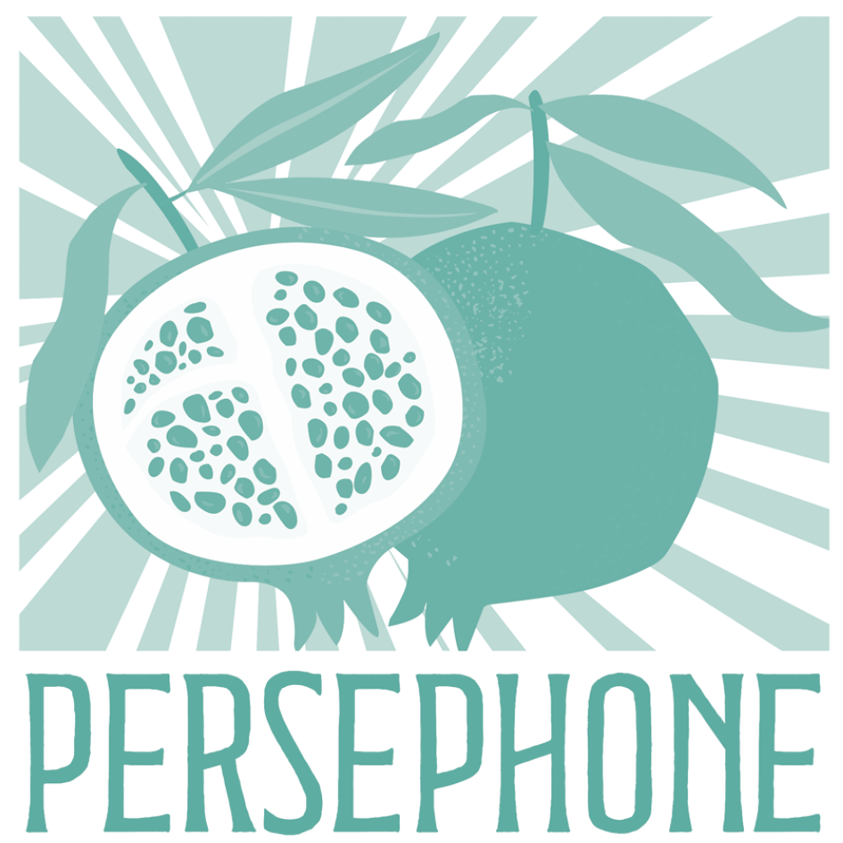

Angebote

# Beratung & Coaching

Beratung bietet Dir die Möglichkeit, innezuhalten, zu reflektieren und eine Sprache für das Unaussprechliche zu finden. Ein sicherer Ort jenseits der medizinischen Routine.

## Was ist Beratung?

Psychosoziale Beratung fokussiert auf die Begleitung in Krisen, bei Neuorientierungen und in belastenden Lebenssituationen bei Menschen, die keine klinische Behandlung (Psychotherapie) aufgrund einer psychischen Erkrankung benötigen. Wir arbeiten ressourcen- und lösungsorientiert an Deiner aktuellen Situation.

Als Sprachwissenschaftlerin und psychosoziale Beraterin in Ausbildung unter Supervision verbinde ich Kommunikationsexpertise mit professioneller Begleitung unter strengster Qualitätssicherung. Ich begleite Dich bzw. Euch dabei, die Trümmer der reproduktiven Krise zu ordnen und neue Handlungsspielräume zu entdecken. Mit linguistischem Feingefühl und psychosozialer Tiefe.

## Formate

## Einzelberatung

Ein geschützter Raum für Deine individuellen Themen im Kinderwunsch.

- Emotionale Entlastung und Begleitung
- Reflexion von Lebensentwürfen und Sinnfragen
- Umgang mit sozialem Druck und Grenzerfahrungen
- Vorbereitung auf medizinische bzw. behördliche Termine

## Paarberatung

Gemeinsam durch den Tunnel: Wir stärken die Verbundenheit als Paar.

- Unterschiedliche Trauer- und Bewältigungsstile verstehen
- Kommunikation in der Krise verbessern
- Gemeinsame Entscheidungsfindung stärken
- Intimität und Sexualität in der Kinderwunschzeit

## Gut zu wissen

#### [Was bedeutet „in Ausbildung unter Supervision“?](#8de675facdd77d05a)

Das bedeutet, dass ich die Ausbildung zur psychosozialen Berater:in (Lebens- und Sozialberatung) weit fortgeschritten absolviere und die dafür gesetzlich vorgeschriebenen Beratungsstunden anbiete. Meine Arbeit wird dabei – anonymisiert und fallbezogen – engmaschig von erfahrenen Supervisor:innen begleitet. Für Dich bedeutet das zusätzliche fachliche Qualitätssicherung.

#### [Was kostet eine Einheit und wie wird sie verrechnet?](#bc5d03812c28634f2)

Solange ich mich in Ausbildung unter Supervision befinde, biete ich die Einheiten gegen einen – auch für mich – fairen Aufwandsersatz. Die genauen Kostenbesprechen wir individuell im Erstgespräch, abgestimmt auf Deine Situation und das gewählte Format. Die Bezahlung erfolgt bar im Anschluss oder per Überweisung im Vorhinein.

#### [Was, wenn ein Termin wider Erwarten abgesagt werden muss?](#da9685c62efa20462)

Termine können bis 48 Stunden vorher kostenfrei abgesagt oder verschoben werden. So kann ein frei werdender Platz an jemand anderen weitergehen, der oder die gerade wartet – und auch ich kann meinen Tag verlässlich planen. Bei kurzfristigeren Absagen muss ich die Sitzung in Rechnung stellen, die exklusiv für Dich reserviert war.

#### [Es ist schwierig, über Persönliches zu sprechen – bleibt alles eh unter uns?](#fcea561c0b2064ce3)

Ja, auf jeden Fall. In der Einzel- und Paarberatung unterliege ich der beruflichen Verschwiegenheitspflicht – was mir anvertraut wird, bleibt auch bei mir.

### Möchtest Du ein Erstgespräch?

Das online Kennenlernen (ca. 20 Min.) ist kostenfrei und dient dem gegenseitigen Beschnuppern und der Klärung Deines Anliegens.

[Termin vereinbaren](https://www.persephone.at/termine/)

