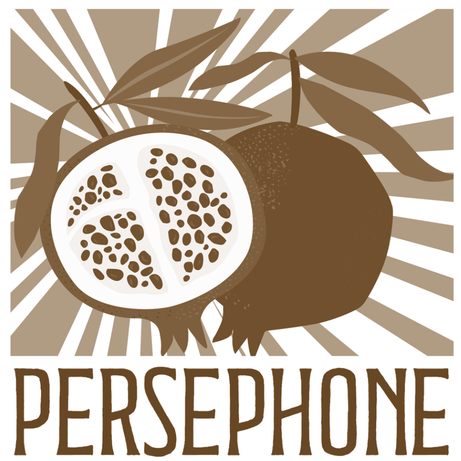

DIE GESCHICHTE

# Persephone ist die Frucht der eigenen Krise

Was 2021 als leise Suche nach Austausch begann, ist heute ein Ort für alle, die durch dieselbe Schwelle gehen. Hier erfährst Du, woher Persephone kommt und wohin die Reise geht.

## Wer Dir hier begegnet

Ich bin Marina Bletsas. Vielleicht kennst Du mich aus meiner Selbsthilfearbeit als Marina von Persephone. So nannte ich mich 2021, als ich aus meiner eigenen Kinderwunschkrise heraus eine Gruppe mit diesem Namen gründete: anonym, bevor ich wusste, wohin diese Reise führen würde.

Der Name war kein Zufall: Der Mythos erzählt von einem Abstieg in die Unterwelt und einer Rückkehr mit neuer Frucht – und ich war mitten in der Dunkelheit, getragen von der Hoffnung eines neuen Gleichgewichts. Was ich noch nicht ahnte: Meine Krise bezog sich nicht nur auf den Kinderwunsch. Die Gruppe, die als Austausch unter Betroffenen begann, verschob mein ganzes Berufsleben: von der universitären Lehre und Forschung als Sprachwissenschaftlerin in das Feld der psychischen Gesundheit.

## Was aus meiner Kinderwunschkrise wuchs

Denn ich merkte: Ich will über die eigene Krise hinaus Menschen mit unerfülltem Kinderwunsch begleiten und wirklich verstehen, wie es um die psychische Gesundheit in einer reproduktiven Krise steht, was für eine Rolle das Paarleben dabei spielt, was macht ungewollte Kinderlosigkeit langfristig aus. Meine linguistiche Kommunikationsexpertise machte mich bereits empfänglich für einiges, was in einer reproduktiven Krise passiert: Paare, die aneinander vorbeireden, ohne es zu merken; Entscheidungen, die sich im Kreis drehen, weil die eigentlichen Gründe nie ausgesprochen werden; Sätze, die etwas ganz anderes verbergen als das, was sie sagen. Ich erkannte diese Muster, weil ich jahrelang untersuchte, wie Menschen im Gespräch Bedeutung herstellen und zu Entscheidungen kommen.

Ich brauchte nun eine Landkarte, um daraus zu wachsen. Also begann ich, mich mit dem geschulten Blick der Wissenschaftlerin dazu einzulesen und einschlägige Erkenntnisse mit meiner Lehrexpertise in die Treffen einfließen zu lassen. Parallel startete ich meine sechsjährige Ausbildung zur Psychotherapeutin und Lebens- und Sozialberaterin.

## Persephone als soziales Unternehmen

Heute ist *Persephone* zu einem professionellen Angebot zur psychosozialen Unterstützung von Menschen mit unerfülltem Kinderwunsch mit Beratung, Workshops und der Selbsthilfegruppe gewachsen, in der alles begann. Was ich Dir hier als Trainerin und Beraterin i.A.u.S. mitbringe, ist also mehr als gelebte Erfahrung – und mehr als Theorie. Meine Perspektive kommt aus kontinuierlicher, vielfältiger, rigoroser, tiefgehender Entwicklung: fachlich *und* persönlich. Für Dich heißt das: In mir findest Du eine Ansprechpartnerin mit einem offenen Ohr für das, was über das unmittelbare Anliegen hinausreicht.

## **Ausbildung**

- **Lebens- und Sozialberatung** | i.A.u.S. bei KEPOS
- **Personzentrierte Psychotherapie** | laufendes Fachspezifikum bei AGP | IPS
- **Psychotherapeutisches Propädeutikum** | ÖAGG
- **Doktorat Sprachwissenschaft** | Schwerpunkt Argumentation, Universität Bonn

## **Felderfahrung**

- **Selbsthilfegruppe unerfüllter Kinderwunsch** | Gründerin & Leiterin, seit 2021
- **Krisenbegleitung für Frauen |** Caritas Steiermark
- **Assistenz Psychotherapeutische Ambulanz** | SFU Wien
- **Validationsarbeit und Betreuung** | Maimonides Zentrum Wien

## **Sprachen**

Deutsch · Italienisch · Englisch

Griechisch (Verständigung möglich)

## [Beratung & Coaching (i.A.u.S.)](https://www.persephone.at/beratung-coaching/)

Ein geschützter Raum, um innezuhalten und Sprache für das zu finden, was sich schwer sagen lässt. Einzeln oder als Paar.

## [Workshops & trainings](https://www.persephone.at/workhops-einzeltrainings/)

Psychoedukation für die reproduktive Krise: Wissen, Werkzeuge und Austausch mit Menschen, die Ähnliches durchmachen.

# Dein nächster Schritt

Manchmal reicht ein kleiner, regelmäßiger Anker: Ehrliche Worte zu einem Thema, über das selten offen gesprochen wird. Der Persephone e-Brief begleitet Dich dabei, in Deinem eigenen Tempo Orientierung zu finden.

[e-Brief abonnieren](https://persephone.at/newsletter)

