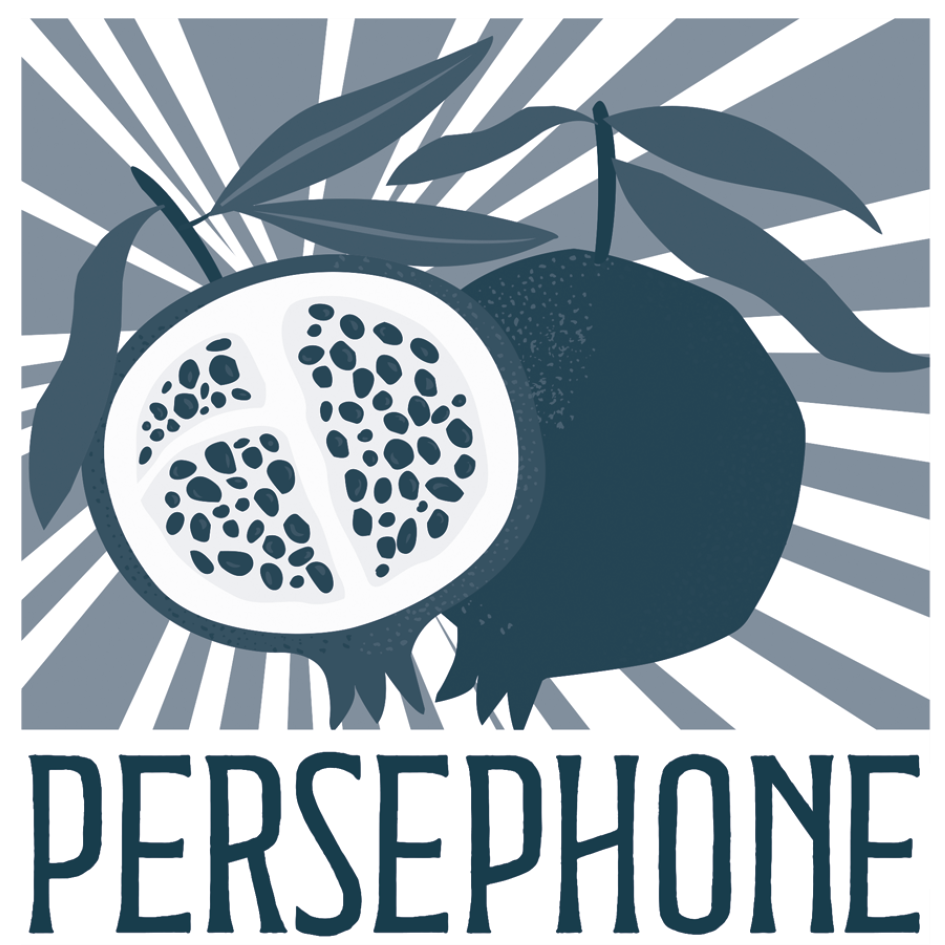

Angebote

# Workshops & Einzeltrainings

Wissen schafft Orientierung. Persephones psychoedukative Angebote vermitteln fundiertes Verständnis für die reproduktive Krise und unterstützen Dich dabei, eigene Bewältigungsstrategien zu entwickeln.

Services

## Was ist Psychoedukation?

Psychoedukation bedeutet, psychologisches Wissen zugänglich zu machen, damit es praktische Orientierungshilfe in schwierigen Lebenssituationen bietet.

Wenn Du verstehst, welche psychischen Prozesse in Krisen ablaufen – wie Emotionen entstehen, wie Trauer sich entwickelt, wie Beziehungen unter Druck reagieren – kannst Du bewusster mit Deinen eigenen Reaktionen umgehen und selbstermächtigter durch Deine reproduktive Krise gehen.

Unsere Angebote richten sich an Dich, wenn Du ein tieferes Verständnis für die psychosozialen Dimensionen ungewollter Kinderlosigkeit entwickeln und Dir dadurch neue Handlungsspielräume eröffnen möchtest.

## Workshops & Trainings

Interaktive Angebote zu psychosozialen Aspekten reproduktiver Krisen. Es werden Themen beleuchtet wie:

- Die Rolle der Psyche in der reproduktiven Krise
- Partnerschaft und ungewollte Kinderlosigkeit
- Umgang mit Fragen und Erwartungen im Familien- und Bekanntenkreis
- Trauer und ambivalente Gefühle
- u.v.m.

WIEN, GRAZ, ONLINE

## Ressourcen

Hier wirst Du demnächst Artikel, Leitfäden und Material zum eigenständigen Vertiefen finden. Du darfst gespannt sein auf:

- Downloadbare Arbeitsblätter
- Leselisten und Buchempfehlungen
- Audio-Reflexionen und Podcasts
- u.v.m.

ONLINE

### Interesse an Psychoedukation im Kinderwunsch?

# Interesse an Psychoedukation im Kinderwunsch?

Melde Dich für den Persephone e-Brief an, um über neue Kurse und Ressourcen informiert zu werden.

[e-Brief abonnieren](/newsletter/)

